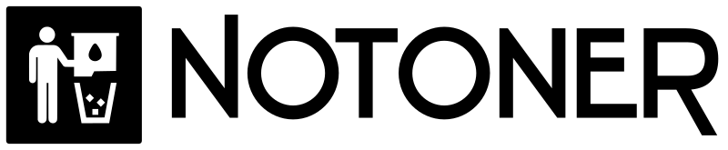
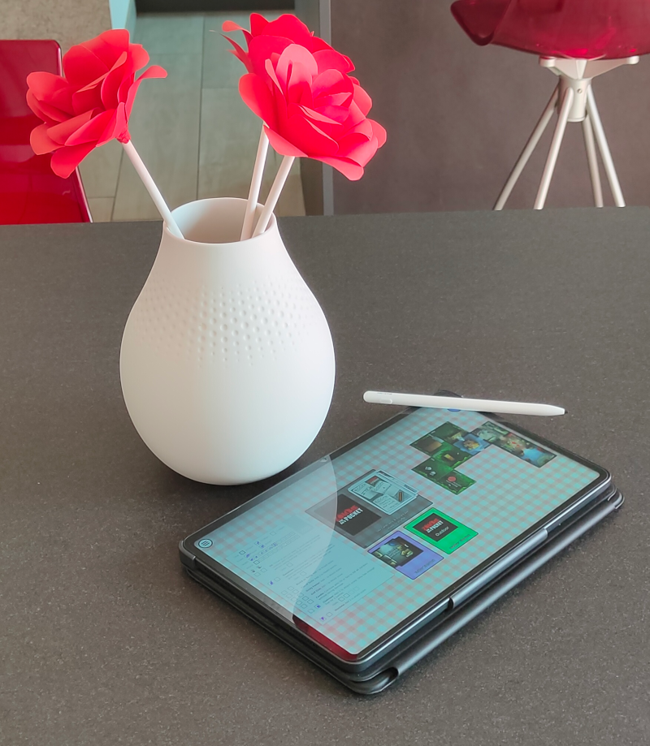
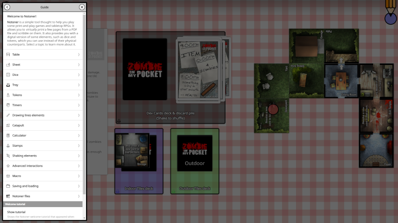
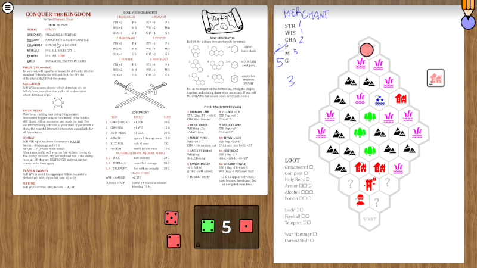

# Notoner

A simple tool thought to help you play some print-and-play games and tabletop RPGs.

---

<a href="https://www.kesiev.com/notoner/">Play!</a> | Developer manual: <a href="assets/reference/reference-EN.md">EN</a> <a href="assets/reference/reference-IT.md">IT</a> | <a href="assets/README.md">Tools</a> | <a href="databases/base/README.md">Templates</a>

---

## The project

**Notoner** is a simple tool thought to help you play some print-and-play games and tabletop RPGs. There are a lot of tools like this around the web - this one is designed around these key features I've chosen:

 - **Self-service**: select a PDF and add some elements such as dice, tokens, etc. from the UI. Then, scribble and play with them on a virtual table.
 - **Mouse and touch**: all element interactions can be done using a mouse or a touch screen...
 - **Keyboard and pen**: ...but you can interact with them faster using a keyboard or a digital pen.
 - **Simple gestures**: shake the dice to roll them, twist tokens with two fingers to rotate them, etc.
 - **A pinch of mobile note-taking apps**: minimal UI with free table rotation, pan, and zoom.
 - **Offline**: play with your friends around a tablet, pass and play, or use a device per player.

I've built this tool around my needs - specifically, to quickly play the games I love without printing them but keeping most of the print-and-play experience _rituals_.

    

    
Playing Zombie in my Pocket print-and-play during a lunch break

As I played more games, more unplanned features appeared and grew along the way, such as **macro** support, **table procedural generation**, and some fun **extra tools** such as calculators, compasses, stamps, and rulers. Some elements evolved in a way that can behave like unimplemented elements: a dice or a token can be customized enough to create simple tiles, cards, or decks of cards. I'll leave you the fun of discovering them.

### Why?

I love the _print-and-play_ "underground" world: it feels like the _garage developers_ of the early _videogame era_, in which designers had to squeeze as much fun as they could using very limited resources - in this case, few sheets and some standard easy-to-find plastic components. I also love the _indie pen-and-paper RPG scene_, which often uses the same tool for even greater purposes.

    

    
Zombie in my Pocket on Notoner, with the program guide opened.

Digital distribution, format standardization, and cheaper printers helped democratize them even more. Heck, the popular independent games distribution platform _itch.io_ has a [whole category](https://itch.io/physical-games) full of these games!

I needed a tool that may _help_ me explore them in a _cheaper_ and _faster_ way. Something that may help me _find and replace_ some of the game elements with a digital counterpart instead of a way to fully play them digitally.

I wanted to keep the original experience as much as I could: start from the original PDF, select some components, and move or roll them around. I also wanted to play them on my Android tablet with a digital pen I gifted myself a few months ago to see if I could still play _as they were on a table_. Nothing more.

    

    
Playing Chronicles of Stampadia on Notoner

Then, I wanted to use it to play [Pulse](https://rpggeek.com/rpg/23464/pulse), an RPG me and my wife love that uses _A3 sheets_ and a _compass_ to draw _colored circles_. Things escalated pretty quickly.

    

    
Playing Conquer the Kingdom on Notoner, featuring the <i>stamps</i> element.

### FAQ

**Q: What happens to the PDFs uploaded/printed by Notoner?**

A: Notoner converts the PDF pages to images locally in your browser using a [JavaScript library](https://github.com/mozilla/pdf.js). In general, there is no server-side part in Notoner.

**Q: The Notoner guide says _I can use the Notoner elements instead of their physical counterparts_. What does it mean?**

A: It's a key _design guideline_ of Notoner! It hasn't been taught to _play board games digitally_, even if possible on some games. It's more of a _companion app_ that may help you _replace_ some game components - what to replace is up to you. Do you want to scribble your character sheet using Notoner and roll your physical dice? Go for it! Do you want to play an RPG that uses a tarot deck but Notoner doesn't support it? Use Notoner to keep the character sheet and use a physical tarot deck.

**Q: I want to distribute my table templates! What can I do?**

A: You can create your save files and distribute them in any way a file can be shared, so the players may download it, load it from the Notoner interface, and play it. You may also distribute your table template library: it is a directory containing a sub-directory for each table template and it looks like the [base database directory](databases/base). The user will download your library and move the template sub-directories on its Notoner instance [extras directory](databases/extras), update its index file running [this script](assets/databases/build.js), and play them selecting from the table templates list. You may also host your instance of Notoner and keep your custom table templates in your [custom directory](databases/custom).

**Q: Can you add a table template I've made to the Notoner base database?**

A: The Notoner base database keeps a set of fun and freely distributable games that may fit as examples for table template developers, as a Notoner features showcase, and as a nice way to kill time. If the table template meets these requirements, fits the project license or _you have authorization from the author_ to do that, use the GitHub tools and we will find a way!

**Q: Can you turn a table save file I've made into a table template to add it to the Notoner base database?**

A: Notoner table templates and save files are very similar, so I suggest you set up a development environment (a local web server serving the Notoner project directory and a web browser should be enough), unpack your save file in the [custom templates directory](databases/custom), and get inspired by the [base templates directory](databases/custom) examples to adapt it. Once your table template is ready, see the previous question answer. If you can't do that, I may try to do that for you instead - use the GitHub tools and we will find a way.

**Q: Can you add [GAME NAME] to the Notoner base database?**

A: If it fits the project features and the game license is compatible with the Notoner license or _you have authorization from the author_, suggest the game using the GitHub tools and we will find a way.

**Q: Can you remove this game from the Notoner base database?**

A: If I've messed something up and added a game I shouldn't, please let me know using GitHub tools.

**Q: Hey, I have an idea...**

A: I'm happy to help and hear your comments and suggestions! You can find me on [Mastodon](https://mastodon.social/@Kesiev), [X](https://x.com/kesiev), and [BGG](https://boardgamegeek.com/user/KesieV). I work on my open-source pet project for fun and in my spare time, which usually shrinks and expands randomly. I'll follow the _wave_ to give you a proper answer ASAP!

_(Do you have some questions about Notoner design? You may want to have a look [here](FAQ.md)!)_

### Font

Notoner mainly uses the [Noto Sans](https://fonts.google.com/noto/specimen/Noto+Sans) font for the UI.

The [Sentiga](https://typodermicfonts.com/downloads/) and [Tangerine](https://tosche.net/fonts/tangerine) fonts are used by table template sheets. If you're going to work on the [table template SVGs](assets/tables/) or the [Notoner images SVGs](assets/images/) make sure to have these fonts installed. A copy of these fonts is in the [assets](assets/fonts/) directory.

Notoner also includes the excellent CC0 [Seshat](http://dotcolon.net/font/seshat/) font that may be used by procedural generators for rendering.

### Credits

  * [Bianca](http://www.linearkey.net/) for her unlimited patience
  * **Preuk** for his friendship and support
  * [Sloan](https://sloank.itch.io/) for allowing me to add [Conquer the Kingdom](https://sloank.itch.io/conquer-the-kingdom) to the Notoner base database.
